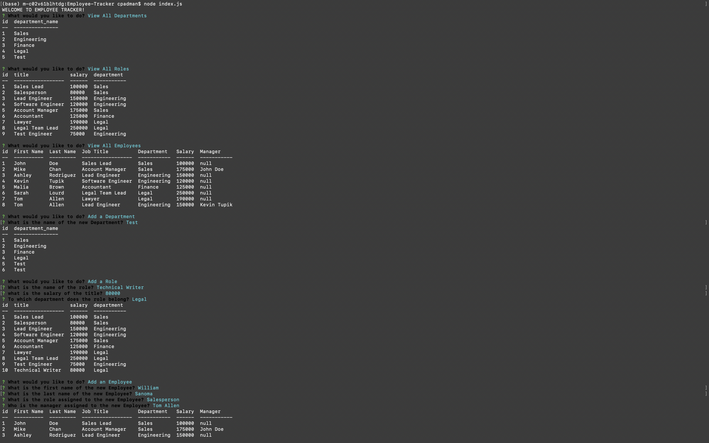
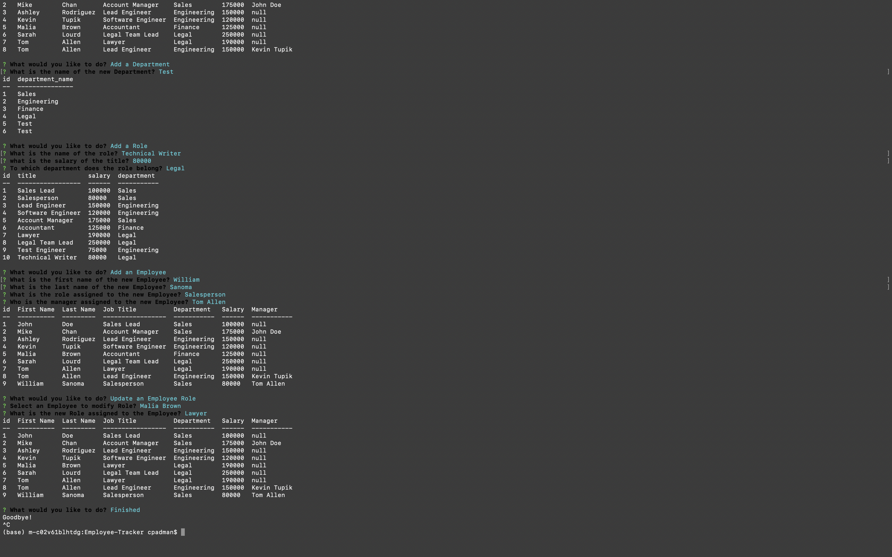

# Employee-Tracker

Command-line Application to view and manage the departments, roles, and employees of a company in order to organize and plan a business.

# Installation

Clone the repositry from GitHub and open using Visual Studio Code.

# Usage

Please see demo video link - https://drive.google.com/file/d/1J7156q3zUErWfJ5HcwadMl3_04-0cwO7/view

# Questions

[Contact me](chitra.iyer00@gmail.com)

[GitHub](https://github.com/ciyer87)
